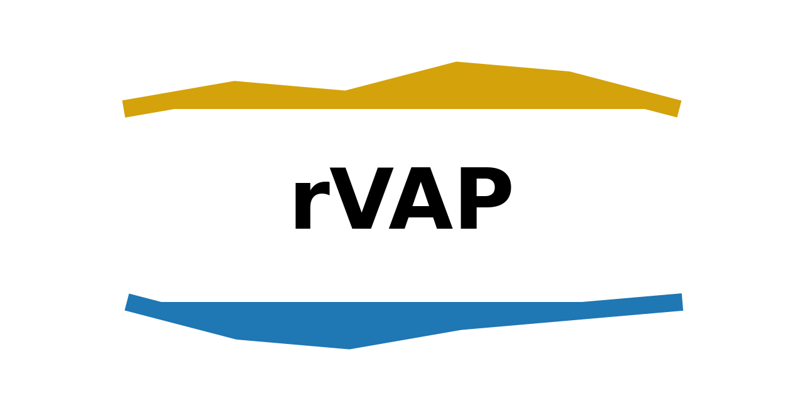
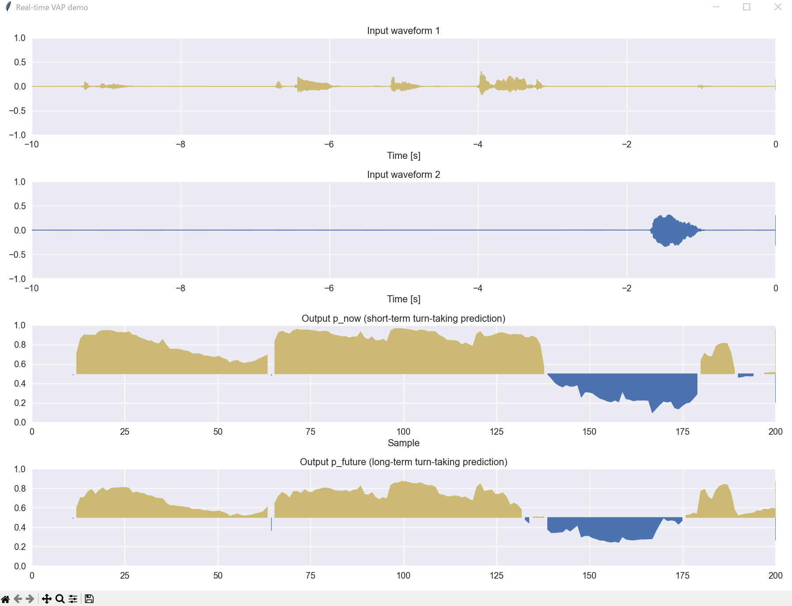

<center>


# Realtime Voice Activity Projection (Realtime-VAP)

README: [English](README.md) | [Japanese](README_JP.md)
</center>

A real-time implementation of Voice Activity Projection (VAP) is aimed at controlling behaviors of spoken dialogue systems, such as turn-taking. The VAP model takes stereo audio data (from two dialogue participants) as input and outputs future voice activity (p_now and p_future).

Details about the VAP model can be found in the following repository:
https://github.com/ErikEkstedt/VoiceActivityProjection

In this repository, the VAP model can operate in real-time in a CPU environment. Please note that using GPUs can increase the processing speed.

The VAP program operates as a program that receives input and outputs processing results through a TCP/IP connection. It is expected that your program will connect to the VAP program via TCP/IP, input the audio data, and receive the VAP results.

<be>

__Demo video on YouTube__ (https://www.youtube.com/watch?v=-uwB6yl2WtI)

[](https://www.youtube.com/watch?v=-uwB6yl2WtI)

## Directory

- __vap_main__ - VAP main directory
- __input__ - Sample programs for input function
- __output__ - SAmple programs for output function
- __asset__ - Model files for VAP and CPC
  - __vap__ - VAP models
  - __cpc__  - Pre-trained CPC models
- __common__ - Utility programs for the VAP process, like how to encode and decode data for communication
  
<br>

## Environment

- __Windows__ - Not support WSL
- __Mac__ - Not support `output/gui.py`
- __Linux__
  
<br>

## Install

This software requires a Python environment.
Please refer to the required libraries listed in `requirements.txt`.

You can directory install the libraries using it as

```bash
$ pip install -r requirements.txt
```

<br>

## How to use

This system can be used in three steps.
The first step is the main part of the VAP model, while the second and third steps are optional for input and output.
This implies that you should ideally structure your system like the second and third steps, using them to provide input audio from your sensor and receive the processing result from VAP.

### Step 1: Launch the main VAP program

When launching the main VAP program, specify both the trained VAP model and the pre-trained CPC model. You can also assign port numbers for input and output.

```bash
$ cd vap_main

$ python vap_main.py ^
    --vap_model ../asset/vap/vap_state_dict_20hz_jpn.pt ^
    --cpc_model ../asset/cpc/60k_epoch4-d0f474de.pt ^
    --port_num_in 50007 ^
    --port_num_out 50008
```

Then, you should see the message like
~~~shell-session
[IN] Waiting for connection of audio input...
~~~

### Step 2: Launch the INPUT program

To test the WAV audio inputs of the sample data, launch `input/wav.py`. You can specify the input WAV file names. Please note, this sample input program requires both individual audio files as input for the model, and a mixed 2-channel audio data for playback. Note that you also need to specify the server IP and port number for the main VAP program.

```bash
$ cd input

$ python wav.py ^
    --server_ip 127.0.0.1 ^
    --port_num 50007 ^
    --input_wav_left wav_sample/jpn_inoue_16k.wav ^
    --input_wav_right wav_sample/jpn_sumida_16k.wav ^
    --play_wav_stereo wav_sample/jpn_mix_16k.wav
```

To capture input audio from the microphone, refer to the sample program `input/mic.py`. This program takes monaural audio data from the default microphone and concatenates it with zero data to fit the VAP input format. This implies that one participant is speaking while the other remains silent. This application is suitable for implementing the VAP model in spoken dialogue systems.

```bash
$ cd input

$ python mic.py ^
    --server_ip 127.0.0.1 ^
    --port_num 50007
```

### Step 3: Launch the OUTPUT program

You can obtain the processing result of the VAP program via TCP/IP. The sample program `output/console.py` is designed to demonstrate how to receive data. It will display the received data on the console. Note that you need to specify the server IP and port number for the main VAP program.

```bash
$ cd output

$ python console.py ^
    --server_ip 127.0.0.1 ^
    --port_num 50008
```

We have also prepared another sample to visualize the received data as `output/gui.py`.
Note that this GUI program does not work in Mac environemtns.

```bash
$ cd output

$ python gui.py ^
    --server_ip 127.0.0.1 ^
    --port_num 50008
```

You would see the GUI visualization like:



<br>

## Data format

It is expected to the users of this repoditory that they would implement the input and output programs according to their own purposes, by referring to the sample programs located in `input` and `output` directories.

### Input

Each data consists of 160 audio samples in 16,000 Hz, with each sample representing the audio data of two individuals. Each audio data sample is represented as an 8-byte double-precision floating-point number in the range of -1.0 to +1.0, in the little endian.

__Transmission Order__:

Data samples are transmitted sequentially in pairs.
The first 8 bytes of each pair represent the audio data for the first individual, followed by 8 bytes for the second individual.

__Example Data Packet Structure__:

 The size of each input data should be 2,560 bytes. 

| Byte Offset | Data type | Description |
| ---- | ---- | --- |
| 0 - 7 | Double | Audio data (Individual 1) - Sample 1 |
| 8 - 15 | Double | Audio data (Individual 2) - Sample 1 |
| 16 - 23 | Double | Audio data (Individual 1) - Sample 2 |
| 24 - 31 | Double | Audio data (Individual 2) - Sample 2 |
| ... | ... | ... |
| 2544 - 2551 | Double | Audio data (Individual 1) - Sample 160 |
| 2552 - 2559 | Double | Audio data (Individual 2) - Sample 160 |

For more concrete examples, please see the sample programs like `input/wav.py` and `input/mic.wav`.

### Output

The output data includes both the input audio data and the VAP outputs (p_now and p_future). Note that the framerate for the VAP processing differs from that of the input audio. For instance, with a 20 Hz model, the length of the VAP audio frame is 800 samples. Also, all data is in little-endian.

__Example Data Packet Structure__:

Under the specified condition, the size of each output data should be 12,860 bytes. This data is distributed after each VAP frame is processed.

| Byte Offset | Data type | Description |
| --- | --- | --- |
| 0 - 3 | Int | Total Data Length (12,860) |
| 4 - 11 | Double | Unix time stamp |
| 12 - 15 | Int | Individual 1 Audio Data Length (800) |
| 16 - 23 | Double | Audio data (Individual 1) - Sample 1 |
| 24 - 31 | Double | Audio data (Individual 1) - Sample 2 |
| ... | ... | ... |
| 6408 - 6415 | Double | Audio data (Individual 1) - Sample 800 |
| 6416 - 6419 | Int | Individual 2 Audio Data Length (800) |
| 6420 - 6427 | Double | Audio data (Individual 2) - Sample 1 |
| 6428 - 6435 | Double | Audio data (Individual 2) - Sample 2 |
| ... | ... | ... |
| 12812 - 12819 | Double | Audio data (Individual 2) - Sample 800 |
| 12820 - 12823 | Int | P_now length (2) |
| 12824 - 12831 | Double | P_now for (Individual 1) |
| 12832 - 12839 | Double | P_now for (Individual 2) |
| 12840 - 12843 | Int | P_future length (2) |
| 12844 - 12851 | Double | P_future for (Individual 1) |
| 12852 - 12859 | Double | P_future for (Individual 2) |

<br>

## Offline (batch) processing

You can also batch process recorded wav files using `vap_main/vap_offline.py`.

```bash
$ cd vap_main

$ python vap_offline.py ^
    --vap_model '../asset/vap/vap_state_dict_20hz_jpn.pt' ^
    --cpc_model ../asset/cpc/60k_epoch4-d0f474de.pt ^
    --input_wav_left ../input/wav_sample/jpn_inoue_16k.wav ^
    --input_wav_right ../input/wav_sample/jpn_sumida_16k.wav ^
    --filename_output 'output_offline.txt'
```

The output data will be saved in `output_offline.txt`, where each line contains the timestamp from the wav file (in seconds) followed by p_now (2 float values) and p_future (2 float values), separated by commas, like this:

```
time_sec,p_now(0=left),p_now(1=right),p_future(0=left),p_future(1=right)
0.07,0.29654383659362793,0.7034487724304199,0.3714706599712372,0.6285228729248047
0.12,0.6943456530570984,0.30564749240875244,0.5658637881278992,0.4341297447681427
0.17,0.8920691013336182,0.10792573541402817,0.7332779169082642,0.26671621203422546
0.22,0.8698683977127075,0.13012604415416718,0.6923539042472839,0.3076401650905609
0.27,0.870344340801239,0.12964950501918793,0.730902373790741,0.26909157633781433
0.32,0.9062888622283936,0.09370578080415726,0.7462385892868042,0.2537555992603302
0.37,0.8965250849723816,0.10346963256597519,0.6949127912521362,0.30508118867874146
0.42,0.9331467151641846,0.06684830039739609,0.7633994221687317,0.2365950644016266
0.47,0.9440065026283264,0.05598851293325424,0.7653886675834656,0.2346058338880539
```

## Model

This repository contains several models for VAP and CPC. To use these models, please abide by the [lisence](#lisence).

### VAP

| Type | Location | Description |
| --- | --- | --- |
| Japanese VAP | `asset/vap/vap_state_dict_20hz_jpn.pt` | Japanese model trained using a Zoom meeting dialogue from [Travel agency dialogue (Inaba 2022)](https://aclanthology.org/2022.lrec-1.619/) |
| English VAP | `asset/vap/vap_state_dict_20hz_eng.pt` | English model trained using [Switchboard corpus](https://catalog.ldc.upenn.edu/LDC97S62) |
| Multi-lingual VAP | `asset/vap/vap_state_dict_20hz_multi_ecj.pt` | Multi-lingual model for English, Mandarin Chinese, and Japanese, trained using [Switchboard corpus](https://catalog.ldc.upenn.edu/LDC97S62), [HKUST Mandarin Telephone Speech](https://catalog.ldc.upenn.edu/LDC2005S15), and [Travel agency dialogue (Inaba 2022)](https://aclanthology.org/2022.lrec-1.619/) |

### CPC

| Type | Location | Description |
| --- | --- | --- |
| Original CPC | `asset/cpc/60k_epoch4-d0f474de.pt` | [Original CPC model](https://github.com/facebookresearch/CPC_audio) trained with Libri-light 60k speech data |

<br>

## Publication

Please cite the following paper, if you made any publications made with this repository.

Koji Inoue, Bing'er Jiang, Erik Ekstedt, Tatsuya Kawahara, Gabriel Skantze<br>
__Real-time and Continuous Turn-taking Prediction Using Voice Activity Projection__<br>
International Workshop on Spoken Dialogue Systems Technology (IWSDS), 2024<br>
https://arxiv.org/abs/2401.04868<br>

If you use the multi-lingual VAP model, please also cite the following paper.

Koji Inoue, Bing'er Jiang, Erik Ekstedt, Tatsuya Kawahara, Gabriel Skantze<br>
__Multilingual Turn-taking Prediction Using Voice Activity Projection__<br>
Joint International Conference on Computational Linguistics, Language Resources and Evaluation (LREC-COLING), pages 11873-11883, 2024<br>
https://aclanthology.org/2024.lrec-main.1036/<br>

<br>

## Lisence

The source code in this repository is licensed under the MIT license.
The trained models, found in the asset directory, are used for only academic purposes.

A pre-trained CPC model, located at `asset/cpc/60k_epoch4-d0f474de.pt`, is from the original CPC project and please follow its specific license.
Refer to the original repository at https://github.com/facebookresearch/CPC_audio for more details.
